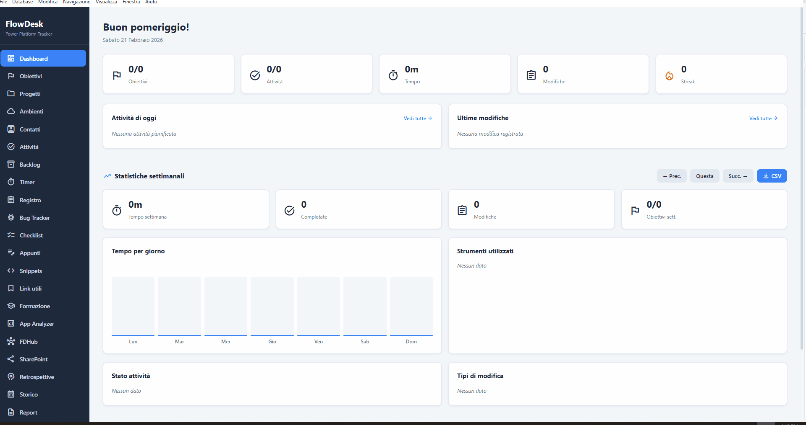

# FlowDesk

[](LICENSE)
[](https://github.com/marco-giuseppe-starace/flowdesk/releases)
[](https://github.com/marco-giuseppe-starace/flowdesk/releases)
[](https://www.electronjs.org/)

<p align="center">
  
</p>

**FlowDesk** è un'applicazione desktop di produttività e tracciamento del lavoro pensata per professionisti che lavorano con la **Microsoft Power Platform** (Power Apps, Power Automate, Power BI, Dataverse, ecc.).

**Versione corrente:** 0.4.0

---

## Why FlowDesk?

Chi lavora con Power Platform gestisce decine di app, flussi, ambienti e task sparsi tra portali web, Excel e note.
**FlowDesk unifica tutto in un unico desktop tool offline-first**: Kanban board, timer, analyzer `.msapp`, version control locale (FDHub), integrazione SharePoint e report PDF — senza dipendere da licenze cloud aggiuntive.
Meno context-switch, più produttività.

---

## Indice

- [Tech Stack](#tech-stack)
- [Installazione e Avvio](#installazione-e-avvio)
- [Prima Configurazione](#prima-configurazione)
- [Guida all'Applicazione](#guida-allapplicazione)
  - [Architettura](#architettura)
  - [Dashboard](#dashboard)
  - [Obiettivi Giornalieri](#obiettivi-giornalieri)
  - [Progetti](#progetti)
  - [Ambienti](#ambienti)
  - [Contatti](#contatti)
  - [Task (Kanban Board)](#task-kanban-board)
  - [Backlog](#backlog)
  - [Timer](#timer)
  - [Pomodoro](#pomodoro)
  - [Registro Modifiche](#registro-modifiche)
  - [Bug Tracker](#bug-tracker)
  - [Checklist](#checklist)
  - [Note](#note)
  - [Snippet](#snippet)
  - [Segnalibri](#segnalibri)
  - [Formazione](#formazione)
  - [Power Apps Analyzer](#power-apps-analyzer)
  - [FDHub](#fdhub)
  - [Retrospettive](#retrospettive)
  - [Statistiche Settimanali](#statistiche-settimanali)
  - [Storico (Calendario)](#storico-calendario)
  - [Report Giornaliero](#report-giornaliero)
  - [Ricerca Globale](#ricerca-globale)
  - [Allegati](#allegati)
  - [Command Palette](#command-palette)
  - [Dark Mode](#dark-mode)
  - [Guida Integrata](#guida-integrata)
- [Gestione Database](#gestione-database)
- [Flusso Dati (Architettura Tecnica)](#flusso-dati-architettura-tecnica)
- [Database](#database)
- [Struttura del Progetto](#struttura-del-progetto)
- [Script Disponibili](#script-disponibili)
- [Scorciatoie da Tastiera](#scorciatoie-da-tastiera)

---

## Tech Stack

| Livello | Tecnologia |
|---|---|
| **Frontend** | React 19 + TypeScript, singolo componente `App.tsx` |
| **Stile** | CSS vanilla (`App.css`), icone Google Material Symbols |
| **Build Tool** | Vite con `@vitejs/plugin-react` |
| **Desktop Shell** | Electron |
| **Database** | SQLite via `better-sqlite3`, modalità WAL, migrazioni automatiche |
| **Packaging** | electron-builder con installer NSIS per Windows |
| **Parser** | `msapp-parser.cjs` — parser custom per file `.msapp` Power Apps |
| **IPC** | `ipcMain.handle` / `ipcRenderer.invoke` (context-isolated, no nodeIntegration) |
| **Dev Tooling** | ESLint, TypeScript, Concurrently, Wait-on |

---

## Installazione e Avvio

```bash
# Clona il repository
git clone <repo-url>
cd flowdesk

# Installa le dipendenze
npm install

# Avvia in modalità sviluppo (Vite + Electron)
npm run dev

# Build per produzione (solo frontend)
npm run build

# Build installer Windows (.exe)
npm run build:app

# Avvia in modalità produzione
npm start
```

L'installer generato si trova in `release/FlowDesk Setup <version>.exe`.

---

## Prima Configurazione

Al primo avvio, FlowDesk chiede dove salvare il database:

- **"Scegli cartella..."** — posizione personalizzata (es. chiavetta USB, cartella condivisa)
- **"Salva su OneDrive"** — se OneDrive è rilevato, crea `OneDrive/FlowDesk/` per la sincronizzazione cloud
- **"Usa predefinita"** — cartella dati dell'app (`%APPDATA%/flowdesk/`)

Se il database è stato precedentemente salvato in una posizione personalizzata e il config viene perso (es. dopo un aggiornamento), FlowDesk:
1. Cerca automaticamente il file `flowdesk.db` in posizioni comuni (Desktop, Documenti, root dei drive, ecc.)
2. Se trovato, propone di riutilizzarlo
3. Altrimenti, chiede all'utente di indicare la cartella o di iniziare una nuova installazione

---

## Guida all'Applicazione

### Architettura

L'app è composta da:
- **Sidebar laterale** (220px fissa) con navigazione tra le 23 viste, organizzate in sezioni: Pianificazione, Esecuzione, Conoscenza, Analisi, Revisione e Utility. Include badge del timer attivo, badge Pomodoro, toggle dark mode, data corrente e versione dell'app.
- **Area principale** che mostra la vista selezionata con header, contenuti, form e liste.

```
┌──────────────────────────────────────────────────┐
│  Sidebar (220px)       │  Area Principale         │
│  ┌──────────────────┐  │  ┌────────────────────┐  │
│  │ Logo "FlowDesk"  │  │  │ Header Vista       │  │
│  │ Pianificazione   │  │  │ KPI / Contenuti    │  │
│  │ Esecuzione       │  │  │ Form / Liste       │  │
│  │ Conoscenza       │  │  │ Kanban / Tabelle   │  │
│  │ Analisi          │  │  │ Grafici / Calendar │  │
│  │ Revisione        │  │  └────────────────────┘  │
│  │ Utility          │  │                          │
│  │ Timer ─ Pomodoro │  │                          │
│  │ Dark Mode ─ v0.2 │  │                          │
│  └──────────────────┘  │                          │
└──────────────────────────────────────────────────┘
```

---

### Dashboard

La **Dashboard** è la schermata principale che appare all'avvio. Mostra una panoramica completa della giornata:

- **KPI (Key Performance Indicators):** 5 card con informazioni rapide:
  - Obiettivi completati su totale
  - Task completati su totale
  - Tempo lavorato nella giornata
  - Numero di modifiche registrate
  - Streak (giorni consecutivi di lavoro)
- **Timer attivo:** se c'è una sessione in corso, mostra il task associato e il tempo trascorso
- **Barra del budget temporale:** confronto tra tempo pianificato e tempo effettivo
- **Anteprima obiettivi:** gli obiettivi del giorno con checkbox
- **Anteprima task:** i primi task della giornata
- **Anteprima modifiche:** le ultime modifiche registrate
- **Avviso backlog:** se ci sono task scaduti non completati, viene mostrato un alert

I dati vengono aggiornati automaticamente ogni **15 secondi**.

---

### Obiettivi Giornalieri

Permette di definire obiettivi per la giornata corrente:

1. Scrivi un obiettivo nel campo di testo
2. Premi "Aggiungi" per inserirlo nella lista
3. Spunta la checkbox per segnarlo come completato
4. Elimina un obiettivo con il pulsante cestino

I progressi vengono tracciati nella Dashboard e nelle statistiche.

---

### Progetti

I **Progetti** organizzano task, modifiche, segnalibri e altre entità sotto un'unica entità colorata:

- **Crea un progetto:** nome, colore, descrizione
- **Statistiche progetto:** per ogni progetto vengono mostrati tempo totale, numero task e numero modifiche
- **Archivia/Riattiva:** i progetti possono essere archiviati e non appariranno più nelle selezioni
- **Elimina:** rimuove il progetto (i task e le modifiche associate restano ma perdono l'associazione)

Ogni task, modifica, segnalibro, contatto, ambiente, bug e repository FDHub può essere assegnato a un progetto.

---

### Ambienti

Gestione degli **ambienti** di sviluppo/test/produzione:

- **Crea un ambiente:** nome, tipo (Sviluppo, Test, UAT, Pre-Produzione, Produzione), URL, descrizione, progetto associato
- **Stato:** ogni ambiente ha uno stato (Attivo, Manutenzione, Inattivo, Sospeso) modificabile direttamente dalla card
- **Modifica inline:** clicca il pulsante edit per modificare tutti i campi direttamente nella card
- **Allegati:** ogni ambiente può avere allegati (es. file `.msapp` della versione attuale dell'app)

---

### Contatti

Rubrica dei **contatti professionali** legati ai progetti:

- **Crea un contatto:** nome, ruolo, email, telefono, azienda, note, progetto associato
- **Modifica inline:** tutti i campi sono modificabili direttamente nella card
- **Allegati:** ogni contatto può avere file allegati
- **Filtro per progetto:** visibile tramite badge colorato

---

### Task (Kanban Board)

I task sono organizzati in una **board Kanban a 3 colonne**:

| Colonna | Significato |
|---|---|
| **Todo** | Task da fare |
| **Doing** | Task in corso |
| **Done** | Task completati |

**Creare un task:**
1. Compila il form con: titolo, descrizione (opzionale), minuti pianificati, priorità (Alta/Media/Bassa), progetto (opzionale)
2. Premi "Crea Task"

**Gestire un task:**
- **Inizia:** sposta il task da Todo a Doing
- **Completa:** sposta il task da Doing a Done
- **Riapri:** riporta il task a Todo
- **Modifica:** apri il modale per modificare tutti i campi
- **Elimina:** rimuovi il task
- **Duplica per domani:** crea una copia dello stesso task per il giorno successivo

**Tag:** puoi associare tag colorati ai task per categorizzarli ulteriormente.

**Template:** puoi salvare un task come template e riutilizzarlo per creare nuovi task rapidamente.

**Allegati:** nel modale di modifica puoi aggiungere file allegati al task.

---

### Backlog

Il **Backlog** mostra tutti i task **non completati** con data schedulata nel passato. Per ogni task puoi:

- **Riprogramma a oggi:** sposta il task alla data odierna
- **Segna come completato:** chiudi il task direttamente dal backlog

Nella Dashboard viene mostrato un avviso quando ci sono task in backlog.

---

### Timer

Il **Timer** permette di tracciare il tempo lavorato su ogni task:

1. Seleziona un task dalla lista
2. Premi **"Avvia Sessione"** per iniziare il cronometro
3. Il tempo scorre e viene mostrato nella sidebar e nella Dashboard
4. Premi **"Ferma Sessione"** per terminare — puoi aggiungere una nota di chiusura opzionale
5. La sessione viene salvata con durata e timestamp

Le sessioni contribuiscono al calcolo del **tempo lavorato** mostrato in Dashboard, statistiche e budget temporale.

Il timer attivo è sempre visibile nella **sidebar** per un accesso rapido, anche quando navighi in altre sezioni.

---

### Pomodoro

La **Tecnica del Pomodoro** è un metodo di gestione del tempo che alterna sessioni di lavoro concentrato a brevi pause, riducendo l'affaticamento mentale e aumentando la produttività. Il nome deriva dal timer da cucina a forma di pomodoro usato dal suo inventore, Francesco Cirillo.

FlowDesk integra un timer Pomodoro completo:

- **Fase di lavoro:** 25 minuti di focus ininterrotto — durante questa fase ti concentri su un singolo task senza distrazioni
- **Pausa:** 5 minuti di riposo — il cervello consolida quanto appreso e si ricarica per il ciclo successivo
- **Cicli:** il conteggio dei cicli completati viene tracciato, così puoi misurare quanti "pomodori" dedichi a ogni attività

**Perché funziona:** lavorare in blocchi di 25 minuti elimina la tentazione del multitasking, crea urgenza positiva e rende il lavoro più sostenibile nel lungo periodo. Dopo 4 cicli è consigliabile una pausa più lunga (15-30 min).

Al termine di ogni fase, ricevi una **notifica nativa del sistema operativo** (tramite le Electron Notification API). Il badge Pomodoro nella sidebar mostra il tempo rimanente anche mentre navighi in altre viste.

---

### Registro Modifiche

Il **Registro Modifiche (Change Log)** è pensato specificamente per tracciare le modifiche fatte su artefatti della Power Platform:

**Campi del form:**
- **Tool:** Power Apps, Power Automate, Power BI, Dataverse, SharePoint, Power Pages, Altro
- **Artefatto:** nome dell'elemento modificato (es. "Screen_Home", "Flow_Approvazione")
- **Tipo di modifica:** Creazione, Modifica, Fix, Eliminazione, Configurazione, Deploy
- **Riepilogo:** breve descrizione della modifica
- **Prima/Dopo (opzionale):** testo prima e dopo la modifica per documentare il cambiamento
- **Esito test:** Passato, Fallito, Non testato
- **Progetto (opzionale):** associa la modifica a un progetto

Le modifiche vengono mostrate nella Dashboard, nelle statistiche e nello storico.

---

### Bug Tracker

Sistema di tracciamento **bug e issue** con categorizzazione per severità:

- **Crea un bug:** titolo, descrizione, severità (Critico, Alto, Medio, Basso), stato, tool, artefatto, passi per riprodurre, soluzione
- **Severità visiva:** ogni card è colorata in base alla severità (rosso per critico, arancio per alto, ecc.)
- **Stato:** Aperto, In Corso, Risolto, Chiuso — modificabile direttamente dalla card
- **Modifica:** modale completo per aggiornare tutti i campi
- **Allegati:** ogni bug può avere file allegati (screenshot, log, ecc.), visibili direttamente nella card e nel modale di modifica
- **Filtro:** filtra per tool (Power Apps, Power Automate, ecc.)

---

### Checklist

Gestione di **checklist riutilizzabili** per procedure operative:

- **Crea una checklist:** nome e descrizione
- **Aggiungi elementi:** ogni checklist ha una lista di item con checkbox
- **Segna completamento:** spunta/deseleziona i singoli elementi
- **Barra di progresso:** mostra la percentuale di completamento

Ideale per procedure di deploy, checklist di test, o qualsiasi lista operativa ripetitiva.

---

### Note

Sezione per appunti categorizzati:

**Categorie disponibili:**
- Meeting, Chiamata, Idea, Promemoria, Problema, Generale

**Funzionalità:**
- Crea note con titolo, contenuto e categoria
- **Fissa (pin):** le note fissate appaiono sempre in cima
- **Modifica:** modale per aggiornare titolo, contenuto e categoria + allegati
- Elimina note esistenti
- Le note sono associate alla data corrente

---

### Snippet

Libreria di **frammenti di codice** riutilizzabili:

**Linguaggi supportati:**
- PowerFx, DAX, M, JSON, SQL, JavaScript, TypeScript, HTML, CSS

**Funzionalità:**
- Crea snippet con titolo, linguaggio, codice e descrizione opzionale
- **Copia con un click:** copia il codice negli appunti
- **Preferiti:** segna gli snippet usati più spesso
- **Ricerca:** filtra per titolo o contenuto
- Modifica e elimina snippet esistenti

Il codice viene mostrato in blocchi con font monospace per una migliore leggibilità.

---

### Segnalibri

Salvataggio di **link utili** categorizzati:

**Categorie:**
- Ambiente (Environment), Documentazione, Repository, SharePoint, API

**Funzionalità:**
- Salva un link con titolo, URL, categoria, descrizione e progetto opzionale
- I link vengono raggruppati per categoria
- Accesso rapido ai link salvati

---

### Formazione

Traccia la tua **crescita professionale** con risorse di apprendimento:

**Categorie:**
- Corso, Certificazione, Libro, Video, Workshop, Documentazione, Altro

**Funzionalità:**
- Aggiungi risorse con titolo, categoria, URL e note
- **Barra di progresso:** slider da 0% a 100% per tracciare l'avanzamento
- **Completamento automatico:** segnato come completato al 100%
- **Modifica:** modale completo con allegati (materiale didattico, certificati, ecc.)
- **Allegati visibili:** file allegati mostrati direttamente nella card e nel modale di modifica
- **Filtro per categoria**

---

### Power Apps Analyzer

Analisi approfondita di file `.msapp` (Power Apps):

1. Clicca **"Carica .msapp"** per selezionare un file dal tuo PC
2. L'app lo analizza automaticamente e mostra:
   - **Health Score:** punteggio complessivo (A-F) con breakdown per Performance, Delegazione, Manutenibilità, Sicurezza, Accessibilità, Architettura
   - **Overview:** conteggio schermate, controlli, formule, data source
   - **Schermate:** lista di ogni screen con conteggio controlli e formule
   - **Formule:** tutte le formule trovate con possibilità di ricerca
   - **DataSource:** connettori e tabelle utilizzate
   - **Issues:** problemi e raccomandazioni categorizzate per severità
   - **Matrice dati:** visualizzazione read/write per ogni datasource

---

### FDHub

**FDHub** è un sistema di **version control locale** per file `.msapp` — una sorta di "GitHub locale" per le tue Power Apps:

**Repository:**
- Crea repository con nome, descrizione e progetto associato
- Modifica ed elimina repository (l'eliminazione rimuove anche tutti i commit e i file)
- Ogni repository è associato a una cartella su disco

**Commit:**
1. Seleziona un repository dalla lista
2. Scrivi un messaggio di commit + tag opzionale (es. "v1.0")
3. Clicca **"Committa .msapp"** — si apre un file dialog per selezionare il file
4. Il file viene **copiato** nel repository, **analizzato** automaticamente (schermate, controlli, formule, data source, issues, health score)
5. Il commit è salvato con tutti i metadati

**Statistiche KPI:** numero commit, health score, schermate, controlli, issues del commit più recente.

**Confronta Commit (Diff):** seleziona due commit e confrontali:
- Schermate aggiunte/rimosse/modificate
- Formule aggiunte/rimosse/cambiate
- DataSource aggiunte/rimosse

**Cronologia Commit:** lista con grafo visivo (dot + line stile Git), tag, metadati, health score colorato.

**Scarica versione:** ogni commit ha un pulsante download per esportare il file `.msapp` — apre un "Salva con nome" di Windows.

**Scorciatoia:** `Ctrl+H` o menu Navigazione → FDHub

---

### Retrospettive

Strumento per le **retrospettive** di fine sprint/settimana:

- **Crea retrospettiva:** data, cosa è andato bene, cosa migliorare, azioni da intraprendere
- **Modifica:** aggiorna qualsiasi campo
- **Storico:** tutte le retrospettive sono elencate in ordine cronologico

---

### Statistiche Settimanali

La vista **Statistiche** mostra grafici a barre e riepiloghi per la settimana selezionata:

- **Tempo giornaliero:** barra per ogni giorno della settimana con i minuti lavorati
- **Utilizzo tool:** distribuzione dell'uso dei vari tool Power Platform
- **Stato task:** quanti task Todo/Doing/Done per giorno
- **Tipi di modifica:** distribuzione delle tipologie di cambiamento
- **Obiettivi completati:** progressi giornalieri

**Esportazione CSV:** puoi esportare tutti i dati della settimana in formato CSV per analisi esterne.

---

### Storico (Calendario)

Vista a **calendario mensile** che mostra i giorni in cui hai lavorato:

- I giorni attivi sono evidenziati
- Cliccando su un giorno, viene caricato un **riepilogo completo**: task, sessioni, modifiche, note e obiettivi di quel giorno
- Naviga tra i mesi con le frecce

---

### Report Giornaliero

Genera automaticamente un **report in formato testo** della giornata selezionata:

Il report include:
- Obiettivi (completati e non)
- Task con stato e tempo lavorato
- Sessioni di lavoro con orari e durata
- Modifiche registrate
- Note della giornata

Premi **"Copia negli appunti"** per copiare il report e incollarlo dove serve (Teams, email, documenti).

---

### Ricerca Globale

La **Ricerca** permette di cercare contemporaneamente tra:

- **Task** (titolo e descrizione)
- **Modifiche** (riepilogo, artefatto, tool)
- **Note** (titolo e contenuto)

I risultati sono raggruppati per categoria e cliccabili.

---

### Allegati

Sistema universale di **allegati** disponibile su molte entità dell'app:

**Entità supportate:**
- Task (nel modale di modifica)
- Note (nel modale di modifica)
- Bug (nella card e nel modale di modifica)
- Contatti (nella card e nel form di modifica)
- Ambienti (nella card e nel form di modifica)
- Formazione (nella card e nel modale di modifica)

**Funzionalità:**
- **Aggiungi:** clicca "Allegati" per espandere, poi il pulsante `+` per selezionare uno o più file dal PC
- **Apri:** clicca il nome del file per aprirlo con l'applicazione predefinita del sistema
- **Elimina:** pulsante cestino per rimuovere l'allegato
- **Info:** per ogni allegato sono mostrati icona (immagine/PDF/documento), nome e dimensione

**Storage:** i file vengono copiati nella cartella del database sotto `attachments/<tipo>/<id>/`, preservando il nome originale. Se il DB è su OneDrive, anche gli allegati vengono sincronizzati.

---

### Command Palette

Premi **`Ctrl+K`** per aprire la **Command Palette** — un accesso rapido a:

- Navigazione tra tutte le viste
- Azioni comuni (nuova attività, apri timer, ecc.)
- Toggle dark mode

Digita per filtrare i comandi e premi per eseguire.

---

### Dark Mode

FlowDesk supporta un **tema scuro** completo:

- Attivabile dalla sidebar (toggle), dalla Command Palette o con **`Ctrl+D`**
- La preferenza viene salvata in `localStorage` e persiste tra le sessioni
- Tutti i componenti (sidebar, card, form, grafici, modali) si adattano al tema

---

### Guida Integrata

Accessibile dalla sidebar (**Guida**) o con **F1**. Mostra la documentazione dell'app direttamente all'interno dell'interfaccia.

---

## Gestione Database

Dal menu **Database** nella barra dei menu puoi:

| Azione | Descrizione |
|---|---|
| **Cambia cartella database** | Sposta il DB (e WAL/SHM) in una nuova cartella a tua scelta |
| **Migra su OneDrive** | Copia DB + allegati + commit FDHub nella cartella OneDrive/FlowDesk per la sincronizzazione cloud. Rileva automaticamente le cartelle OneDrive (personale e aziendale) tramite filesystem e registro di Windows |
| **Esporta database** | Salva una copia del DB in un file `.db` a tua scelta |
| **Importa database** | Sostituisce il DB corrente con un file `.db` importato (con conferma) |
| **Apri cartella database** | Apre la cartella contenente il DB in Esplora File |

**Backup automatico:** ad ogni avvio, FlowDesk crea un backup del database nella stessa cartella (se il file supera una certa dimensione).

**Recupero automatico:** se il file di configurazione viene perso (es. dopo un aggiornamento), FlowDesk cerca automaticamente il database in posizioni comuni e offre il recupero dei dati.

**Compatibilità OneDrive:** SQLite funziona su cartelle OneDrive sincronizzate in modalità mono-utente. La modalità WAL + backup automatico garantiscono robustezza.

---

## Flusso Dati (Architettura Tecnica)

L'applicazione segue un'architettura a 3 livelli comunicanti via IPC:

```
┌─────────────────────────────────────────────────────────────────┐
│                       RENDERER (React)                          │
│  App.tsx → chiama window.flowdesk.method()                      │
└────────────────────────────┬────────────────────────────────────┘
                             │ ipcRenderer.invoke(channel, args)
                             ▼
┌─────────────────────────────────────────────────────────────────┐
│                      PRELOAD (preload.cjs)                      │
│  contextBridge.exposeInMainWorld('flowdesk', { ... })           │
│  Espone ~80+ metodi come API sicura                             │
└────────────────────────────┬────────────────────────────────────┘
                             │ IPC channel
                             ▼
┌─────────────────────────────────────────────────────────────────┐
│                     MAIN PROCESS (main.cjs)                     │
│  ipcMain.handle(channel) → chiama funzione db.cjs              │
│  Gestisce file dialog, file system, menu, notifiche             │
└────────────────────────────┬────────────────────────────────────┘
                             │ query SQL / file I/O
                             ▼
┌─────────────────────────────────────────────────────────────────┐
│                      DATABASE (db.cjs)                           │
│  SQLite via better-sqlite3 — file: {cartella scelta}/flowdesk.db│
│  22 tabelle, modalità WAL, prepared statements, migrazioni v2   │
└─────────────────────────────────────────────────────────────────┘
```

**Ciclo di una chiamata:**
1. L'utente interagisce con la UI React
2. Un handler React chiama `window.flowdesk.nomeMetodo(args)`
3. Il preload invoca `ipcRenderer.invoke('canale', args)`
4. Il main process riceve via `ipcMain.handle('canale')` e chiama la funzione corrispondente in `db.cjs`
5. `db.cjs` esegue la query SQLite e restituisce il risultato
6. Il risultato risale la catena fino a React, che aggiorna lo stato e ri-renderizza

**Sync automatico:** ogni 15 secondi l'app esegue `refreshAll()` che lancia chiamate IPC in parallelo per aggiornare tutti i dati.

---

## Database

Il database SQLite è salvato nella cartella scelta dall'utente alla prima configurazione (default: `%APPDATA%/flowdesk/flowdesk.db`).

Il sistema di **migrazioni** (`MIGRATIONS` array in `db.cjs`) garantisce l'aggiornamento automatico dello schema quando l'app viene aggiornata. La versione corrente dello schema è **v2**.

### Tabelle

| Tabella | Descrizione |
|---|---|
| **tasks** | Task giornalieri con titolo, descrizione, minuti pianificati, priorità, stato, data, progetto |
| **work_sessions** | Sessioni di lavoro legate ai task con timestamp inizio/fine, durata e nota |
| **change_entries** | Registro modifiche con tool, artefatto, tipo, riepilogo, prima/dopo, esito test, progetto |
| **notes** | Note categorizzate con titolo, contenuto, pin e data |
| **daily_goals** | Obiettivi giornalieri con testo, stato completamento e ordine |
| **projects** | Progetti con nome, colore, descrizione e flag archiviazione |
| **tags** | Tag riutilizzabili con nome e colore |
| **task_tags** | Associazione many-to-many tra task e tag |
| **task_templates** | Template di task riutilizzabili |
| **snippets** | Frammenti di codice con linguaggio e flag preferito |
| **bookmarks** | Segnalibri categorizzati con URL e progetto |
| **contacts** | Rubrica contatti con ruolo, email, telefono, azienda, progetto |
| **environments** | Ambienti di sviluppo/test/produzione con tipo, stato, URL |
| **retrospectives** | Retrospettive con cosa è andato bene/migliorare/azioni |
| **bugs** | Bug tracker con severità, stato, tool, artefatto, passi, soluzione |
| **learning** | Risorse di formazione con categoria, progresso, URL |
| **checklists** | Checklist con nome e descrizione |
| **checklist_items** | Elementi delle checklist con stato completamento |
| **fdhub_repos** | Repository FDHub con nome, descrizione, tipo app, progetto |
| **fdhub_commits** | Commit FDHub con messaggio, tag, file, analisi (health score, screen/control/formula count, issue count) |
| **attachments** | Allegati con tipo entità, ID entità, nome file, percorso, dimensione, MIME type |
| **schema_version** | Versione corrente dello schema del database |

---

## Struttura del Progetto

```
flowdesk/
├── electron/
│   ├── main.cjs            # Processo principale Electron: finestra, menu, IPC, file dialog
│   ├── preload.cjs          # Preload: espone ~80+ metodi API sicura via contextBridge
│   ├── db.cjs               # Layer database: schema, migrazioni v2, ~60+ funzioni CRUD
│   └── msapp-parser.cjs     # Parser per file .msapp Power Apps (schermate, formule, health score, diff)
├── src/
│   ├── App.tsx              # Intera UI React: tipi, stato, handler, 23 viste, modali, allegati
│   ├── App.css              # Tutti gli stili: layout, sidebar, card, kanban, FDHub, allegati, dark mode
│   ├── main.tsx             # Entry point React: renderizza <App /> in #root
│   └── index.css            # Reset globali: font, box-sizing
├── public/                  # Asset statici
├── build/
│   └── icon.ico             # Icona dell'applicazione
├── scripts/
│   └── start-electron.cjs   # Launcher per modalità produzione
├── release/                 # Output dell'installer (.exe)
├── example_msapps/          # File .msapp di esempio per test
├── index.html               # Shell HTML: carica font Material Symbols e modulo Vite
├── package.json             # Dipendenze, script, configurazione electron-builder
├── vite.config.ts           # Configurazione Vite
├── tsconfig.json            # Configurazione TypeScript base
├── tsconfig.app.json        # Config TS per l'app (src/)
├── tsconfig.node.json       # Config TS per Vite/Node
└── eslint.config.js         # Configurazione ESLint
```

---

## Script Disponibili

| Script | Comando | Descrizione |
|---|---|---|
| `dev` | `npm run dev` | Avvia Vite + Electron in parallelo (sviluppo) |
| `dev:web` | `npm run dev:web` | Avvia solo il server Vite sulla porta 5173 |
| `dev:desktop` | `npm run dev:desktop` | Attende Vite e poi avvia Electron |
| `build` | `npm run build` | Compila TypeScript + build Vite per produzione |
| `build:app` | `npm run build:app` | Build completa + installer Windows NSIS (.exe) |
| `start` | `npm start` | Avvia Electron in modalità produzione |
| `lint` | `npm run lint` | Esegue ESLint |
| `preview` | `npm run preview` | Preview della build di produzione |

---

## Scorciatoie da Tastiera

| Scorciatoia | Azione |
|---|---|
| `Ctrl+1` | Dashboard |
| `Ctrl+2` | Obiettivi |
| `Ctrl+3` | Progetti |
| `Ctrl+4` | Ambienti |
| `Ctrl+5` | Contatti |
| `Ctrl+6` | Attività |
| `Ctrl+T` | Timer |
| `Ctrl+R` | Registro Modifiche |
| `Ctrl+N` | Appunti |
| `Ctrl+S` | Snippets |
| `Ctrl+L` | Link utili |
| `Ctrl+P` | Power Apps Analyzer |
| `Ctrl+H` | FDHub |
| `Ctrl+F` | Ricerca |
| `Ctrl+K` | Command Palette |
| `Ctrl+D` | Toggle Dark Mode |
| `Ctrl+Q` | Esci |
| `F1` | Guida |
